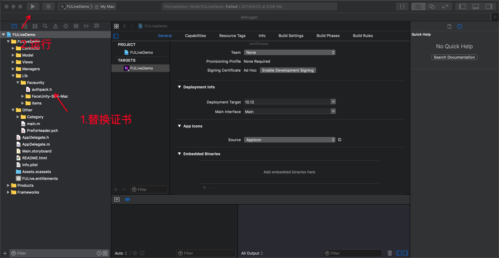

# Demo运行说明文档-Mac  

级别：Public   
更新日期：2019-07-08   

------

**FaceUnity Nama SDK v6.2.0 (2019.07.08)**

更新内容

- 优化人脸检测，提高正脸大角度检测率。
- 优化背景分割，提高准确度。
- 优化手势识别，提供15种手势；手势模型支持独立运行，见FUCreator文档。
- 优化人脸美妆，提高准确度，支持更丰富的效果。
- 优化人脸跟踪模块边缘人脸抖动问题。  
- 修复多人脸舌头跟踪相互影响问题。 
- 修复avatar模式下fxaa抗锯齿失效问题。
- 废弃高精度模型 armesh_ex.bundle，以及对应的接口 fuLoadExtendedARData。
- 废弃人脸表情动画模型 anim_model.bundle, 以及对应的接口 fuLoadAnimModel。
  注：废弃的数据以及接口，可能引起编译不通过，移除代码即可。

------
### 目录：
本文档内容目录：

[TOC]

------
### 1. 简介 
本文档旨在说明如何将Faceunity Nama SDK的Mac Demo运行起来，体验Faceunity Nama SDK的功能。FULiveDemoMac 是集成了 Faceunity 面部跟踪、美颜、Animoji、道具贴纸、AR面具、换脸、表情识别、音乐滤镜、背景分割、手势识别、哈哈镜以及人像驱动功能的Demo。Demo将根据客户证书权限来控制用户可以使用哪些产品。

------
### 2. Mac Demo文件结构
本小节，描述Mac Demo文件结构，各个目录，以及重要文件的功能。

```
+FULiveDemo
  +FULiveDemo 			  	//原代码目录
    +Controller             //控制器文件夹
      -FUCameraSetController.h.m   //相机视图控制器
      -FUBeautyViewController.h.m  //美颜视图控制器
      ...
    +Model                  //数据模型文件夹
      -FUBeautyModel        //美颜数据模型
      -FUMakeupModle        //质感美妆数据模型
      ...
    +Views                  //视图文件夹  
      -FUBeautyTableView              //美颜列表
      +OpenGLView           //0penGLView 
      ...  
    +Managers				//业务类文件夹
      -FUManager             //nama 业务类
      -FUAppDataCenter       	  //数据管理类
      -FUConstManager       //常量管理类
      ...
    +Lib                    //nama SDK  
      +Faceunity
        -authpack.h             //权限文件
        +FaceUnity-SDK-Mac
          +Headers
            -funama.h                //C 接口
            -FURenderer.h            //OC 接口
          +Resources               //SDK 重要功能资源
            -ardata_ex.bundle    //高精度数据模型
            -tongue.bundle       //舌头驱动数据模型
            -fxaa.bundle         //3D道具去锯齿道具
          -libnama.a               //Nama库
        +items                   //个个模块道具资源 
  +Other						//其他
    +Category               //分类
    +PrefixHeader           //全局头  
```

------
### 3. 运行Demo 

#### 3.1 开发环境
##### 3.1.1 支持平台
```
macOS 10.6以上系统
```
##### 3.1.2 开发环境
```
Xcode 8或更高版本
```

#### 3.2 准备工作 
- [下载FULiveDemoMac](https://github.com/Faceunity/FULiveDemoMac)
- 替换证书文件 **authpack.h**，获取证书 见 **3.3.1**

#### 3.3 相关配置
##### 3.3.1 导入证书
您需要拥有我司颁发的证书才能使用我们的SDK的功能，获取证书方法：

1、拨打电话 **0571-89774660** 

2、发送邮件至 **marketing@faceunity.com** 进行咨询。

iOS端发放的证书为包含在authpack.h中的g_auth_package数组，如果您已经获取到鉴权证书，将authpack.h导入工程中即可。根据应用需求，鉴权数据也可以在运行时提供(如网络下载)，不过要注意证书泄露风险，防止证书被滥用。

#### 3.4 编译运行


------
### 4. 常见问题 

#### 4.1 运行报错

第一运行Demo会报缺少证书的 error ,如果您已拥有我司颁发的证书，将证书替换到工程中重新运行即可。

